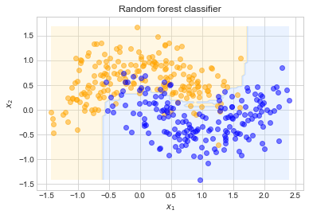
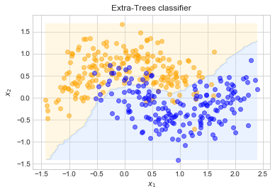
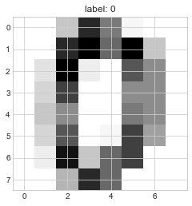
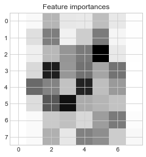
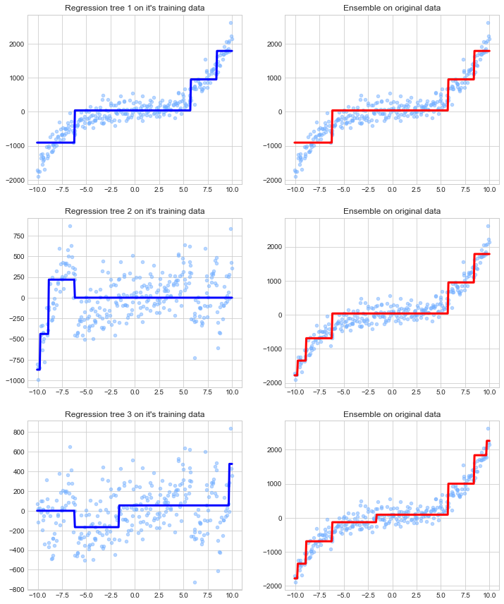
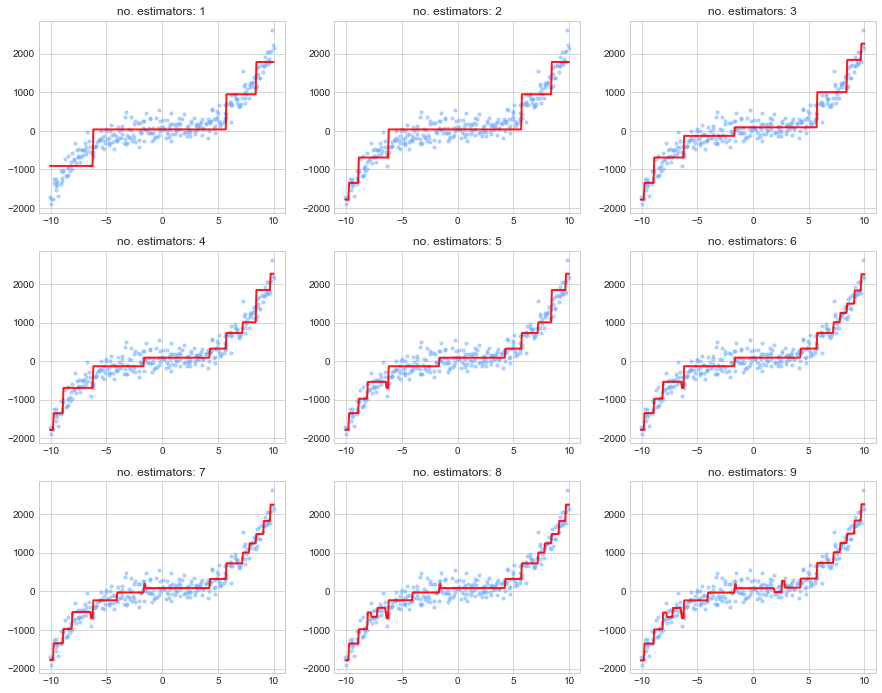
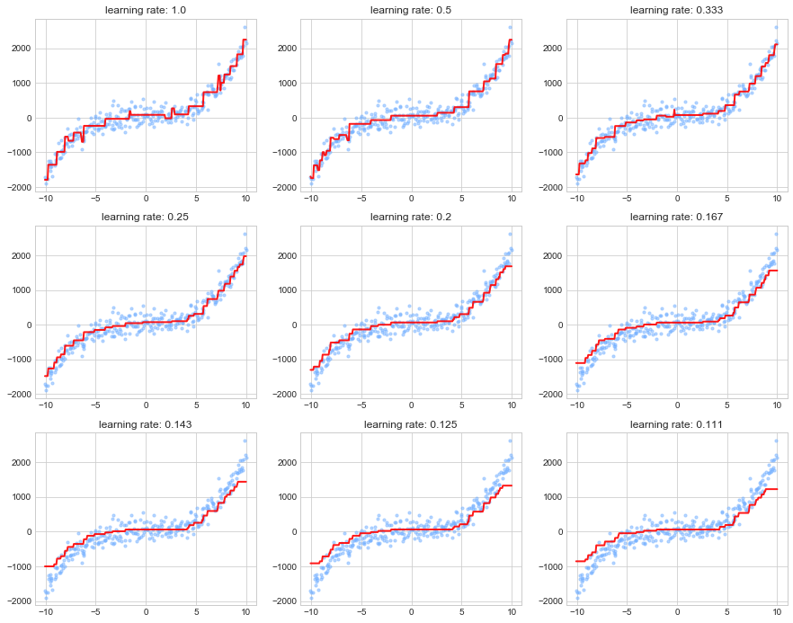
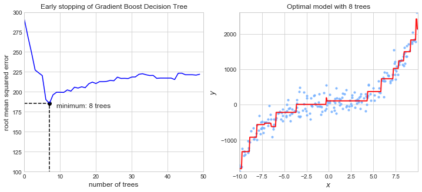

# Chapter 7. Ensemble Learning and Random Forests

Aggregating the predictions from multiple predictors is often better than an individual predictor ("wisdom of the crowd").
These are called *ensemble methods*.
It is common to use an ensemble method towards the end of a project after a few good individual classifiers have been found.

This chapter discusses **bagging**, **boosting**, **stacking**, and **Random Forests**.


```python
import numpy as np
import pandas as pd 
import matplotlib.pyplot as plt

np.random.seed(0)

plt.style.use('seaborn-whitegrid')
```


```python
%matplotlib inline
```


```python
%load_ext ipycache
```

    /opt/anaconda3/envs/daysOfCode-env/lib/python3.7/site-packages/IPython/config.py:13: ShimWarning: The `IPython.config` package has been deprecated since IPython 4.0. You should import from traitlets.config instead.
      "You should import from traitlets.config instead.", ShimWarning)
    /opt/anaconda3/envs/daysOfCode-env/lib/python3.7/site-packages/ipycache.py:17: UserWarning: IPython.utils.traitlets has moved to a top-level traitlets package.
      from IPython.utils.traitlets import Unicode


## Voting classifiers

The idea behind the power of ensemble method can be explained by thinking about a slightly biased coin. 
If the coin has a 51% chance of being heads, this won't be noticeable with a few coin flips, though, after thousands, the ratio of heads to tails will be distinct.
This applies similarly to an ensemble of weak classifiers.
However, one caveat is that the ensemble of weak classifiers are unlikely to be perfectly independent from each other as they are trained on the same data.
Therefore, the strongest ensemble methods use multiple model types that use various training methodologies to create a diverse and more independent group of models.

The following example shows the use of logisitic regression, a random forest classifier, and a SVM in a simple ensemble.


```python
from sklearn.linear_model import LogisticRegression
from sklearn.svm import SVC
from sklearn.ensemble import RandomForestClassifier
from sklearn.ensemble import VotingClassifier
from sklearn.datasets import make_moons
from sklearn.model_selection import train_test_split
from sklearn.metrics import accuracy_score

# Individual classifiers.
log_clf = LogisticRegression(solver='lbfgs')
rnd_clf = RandomForestClassifier(max_depth=3, n_estimators=100)
svm_clf = SVC(probability=True, gamma='scale')

# Hard voting classifier ensemble.
voting_clf_hard = VotingClassifier(
    estimators=[('lr', log_clf), ('rf', rnd_clf), ('svc', svm_clf)],
    voting='hard'
)

# Soft voting classifier ensemble.
voting_clf_soft = VotingClassifier(
    estimators=[('lr', log_clf), ('rf', rnd_clf), ('svc', svm_clf)],
    voting='soft'
)

# Make moon data.
X, y = make_moons(n_samples=10000, noise=0.4, random_state=0)
X_train, X_test, y_train, y_test = train_test_split(X, y, random_state=0)

# Train and test each model.
for clf in (log_clf, rnd_clf, svm_clf, voting_clf_hard ,voting_clf_soft):
    clf.fit(X_train, y_train)
    y_pred = clf.predict(X_test)
    print(f'{clf.__class__.__name__}: {accuracy_score(y_test, y_pred)}')
```

    LogisticRegression: 0.8332
    RandomForestClassifier: 0.8628
    SVC: 0.8692
    VotingClassifier: 0.8632
    VotingClassifier: 0.8632


If all of the models have a `predict_proba()` method, then the `VotingVlassifier` can use "soft" voting to weight each prediction by the certainty of the model (by just predicting the class with the highest average probability).
This often produces better results than "hard" voting which predicts the most frequently predicted class over all of the models.

## Bagging and pasting

Another way to get a diverse group of models is to train the same algorithm with different random samples of the data.
*Bagging* (short for "bootstrap aggregating") and *pasting* are two such methods, where sampling is conducted with and without replacement.
The aggregation process is usually the statistical mode (the most frequent prediction) for classification and the mean for regression.

### Bagging and pasting in scikit-Learn

Scikit-Learn offers the [`BaggingClassifier`](https://scikit-learn.org/stable/modules/generated/sklearn.ensemble.BaggingClassifier.html) and [`BaggingRegressor`](https://scikit-learn.org/stable/modules/generated/sklearn.ensemble.BaggingRegressor.html) classes.
The following example trains 500 decision tree classifiers on 100 boostrapped instances of the training data.
Pasting can be accomplished by setting `bootstrap=False`.


```python
from sklearn.ensemble import BaggingClassifier
from sklearn.tree import DecisionTreeClassifier
from sklearn.datasets import make_moons
from sklearn.model_selection import train_test_split

X, y = make_moons(500, noise=0.3, random_state=0)
X_train, X_test, y_train, y_test = train_test_split(X, y, random_state=0)

plt.scatter(X_train[:, 0][y_train==0], 
            X_train[:, 1][y_train==0], 
            color='orange', 
            alpha=0.5)
plt.scatter(X_train[:, 0][y_train==1], 
            X_train[:, 1][y_train==1], 
            color='blue', 
            alpha=0.5)
plt.xlabel('$x_1$')
plt.ylabel('$x_2$')
plt.show()
```


```python
bag_clf = BaggingClassifier(
    DecisionTreeClassifier(),
    n_estimators=500,
    max_samples=100,
    bootstrap=True,
    n_jobs=-100
)
bag_clf.fit(X_train, y_train)
```


    BaggingClassifier(base_estimator=DecisionTreeClassifier(class_weight=None,
                                                            criterion='gini',
                                                            max_depth=None,
                                                            max_features=None,
                                                            max_leaf_nodes=None,
                                                            min_impurity_decrease=0.0,
                                                            min_impurity_split=None,
                                                            min_samples_leaf=1,
                                                            min_samples_split=2,
                                                            min_weight_fraction_leaf=0.0,
                                                            presort=False,
                                                            random_state=None,
                                                            splitter='best'),
                      bootstrap=True, bootstrap_features=False, max_features=1.0,
                      max_samples=100, n_estimators=500, n_jobs=-100,
                      oob_score=False, random_state=None, verbose=0,
                      warm_start=False)


```python
from matplotlib.colors import ListedColormap

def plot_tree_classifier(clf, X, y):
    """Plot a colormap of the decisions for a classifier."""
    
    axes = [
        min(X[:, 0]), max(X[:, 0]),
        min(X[:, 1]), max(X[:, 1]),
    ]
    
    # Create a mesh to predict over.
    x1s = np.linspace(axes[0], axes[1], 100)
    x2s = np.linspace(axes[2], axes[3], 100)
    x1, x2 = np.meshgrid(x1s, x2s)
    X_new = np.c_[x1.ravel(), x2.ravel()]
    y_pred = clf.predict(X_new).reshape(x1.shape)
    
    # Plot the contour of the predictions.
    custom_cmap = ListedColormap(['#ffe7a6', '#bad6ff'])
    plt.contourf(x1, x2, y_pred, alpha=0.3, cmap=custom_cmap)
    
    
    plt.scatter(X[:, 0][y==0], X[:, 1][y==0], color='orange', alpha=0.5)
    plt.scatter(X[:, 0][y==1], X[:, 1][y==1], color='blue', alpha=0.5)
    
    plt.xlabel('$x_1$')
    plt.ylabel('$x_2$')  
```


```python

single_tree = DecisionTreeClassifier()
single_tree.fit(X_train, y_train)

fig = plt.figure(figsize=(12, 6))
plt.subplot(1, 2, 1)
plot_tree_classifier(single_tree, X_train, y_train)
plt.title("Single decision tree classifier")

plt.subplot(1, 2, 2)
plot_tree_classifier(bag_clf, X_train, y_train)
plt.title("500 decision tree classifiers with bagging")

plt.show()
```


```python
# Accuracy of single tree on test data.
accuracy_score(y_test, single_tree.predict(X_test))
```


    0.872


```python
# Accuracy of bagging classifier on test data.
accuracy_score(y_test, bag_clf.predict(X_test))
```


    0.88


```python
from sklearn.metrics import roc_curve, auc

def get_auc_data(clf, x_test, y_test):
    y_score = clf.predict_proba(x_test)[:, 1]
    fpr, tpr, _ = roc_curve(y_test, y_score)
    roc_auc = auc(fpr, tpr)
    return fpr, tpr, roc_auc


fpr, tpr, auc_bag = get_auc_data(bag_clf, X_test, y_test)
plt.plot(fpr, tpr, 'b-', 
         label=f'bagging (AUC: {np.round(auc_bag, 2)})')

fpr, tpr, auc_single = get_auc_data(single_tree, X_test, y_test)
plt.plot(fpr, tpr, 'r-', 
         label=f'single tree (AUC: {np.round(auc_single, 2)})')

plt.xlabel('FPR')
plt.ylabel('TPR')
plt.title('ROC for decision tree models')
plt.legend(loc='lower right')
plt.axis([-0.01, 1.01, -0.01, 1.01])
plt.show()
```


### Out-of-bag evaluation

During the sampling procedure for each model in a bagging classifier/regressor, it is likely that a large fraction of the training instances will not be used.
These are called *out-of-bag* (oob) instances and can be used to validate each model in the ensemble.
The ensemble itself can be evaluated by averaging out each oob prediction.
This oob score should be close to the accuracy of the model on the test set.

This can be automatically accomplished in Scikit-Learn by setting `oob_score=True`.
The value is stored in `clf.oob_score_`.


```python
bag_clf = BaggingClassifier(
    DecisionTreeClassifier(),
    n_estimators=500,
    max_samples=100,
    bootstrap=True,
    n_jobs=-100,
    oob_score=True
)
bag_clf.fit(X_train, y_train)

bag_accuracy = accuracy_score(y_test, bag_clf.predict(X_test))
print(
f'''
bagging oob score: {np.round(bag_clf.oob_score_, 4)}
accuracy on test data: {np.round(bag_accuracy, 4)}
''')
```

    
    bagging oob score: 0.8907
    accuracy on test data: 0.888
    


Further, all of the oob scores for each model of the ensemble is available in the `clf.oob_decision_function_` attribute.


```python
bag_clf.oob_decision_function_[1:5, ]
```


    array([[0.        , 1.        ],
           [0.2556962 , 0.7443038 ],
           [0.88541667, 0.11458333],
           [0.00253807, 0.99746193]])


## Random patches and random subspaces

The *random subspaces* method is when an ensemble of models is created, each one only using a random subset of the features (but all of the training instances).
The *random patches* method is when an both the features and data are randomly sampled for each model of the ensemble.
They are particularly useful when dealing with high-dimensional data.

## Random forests

A *random forest* is just an ensemble of decision trees.
Generally, they are trained using the bagging method.

Scikit-Learn created optimized classes for random forests, [`RandomForestClassifier`](https://scikit-learn.org/stable/modules/generated/sklearn.ensemble.RandomForestClassifier.html) and [`RandomForestRegressor`](https://scikit-learn.org/stable/modules/generated/sklearn.ensemble.RandomForestRegressor.html).
For the most part, these classes are simillar to passing a single decision tree to a `BaggingClassifier/Regressor`, with a few changes to the hyperparameters.
However, one difference is that the splitting algorithm for each tree in the `RandomForestClassifier/Regressor` uses only a subset of the features.
This leads to greater diversity in the forest.


```python
from sklearn.ensemble import RandomForestClassifier

# A random forest of 500 decision tree classifiers.
rnd_clf = RandomForestClassifier(n_estimators=500,
                                 max_leaf_nodes=16,
                                 oob_score=True,
                                 n_jobs=-1,
                                 random_state=0)

# Train on the mood data.
rnd_clf.fit(X_train, y_train)

# Accuracy of the random forest classifier.
train_acc = accuracy_score(y_train, rnd_clf.predict(X_train))
test_acc = accuracy_score(y_test, rnd_clf.predict(X_test))

print(
    f'''
Random Forest Classifier evaluation
        oob score: {np.round(rnd_clf.oob_score_, 3)}
training accuracy: {np.round(train_acc, 3)}
 testing accuracy: {np.round(test_acc, 3)}
'''
)
```

    
    Random Forest Classifier evaluation
            oob score: 0.883
    training accuracy: 0.941
     testing accuracy: 0.888
    


```python
plot_tree_classifier(rnd_clf, X_train, y_train)
plt.title("Random forest classifier")
plt.show()
```





### Extremely Randomized Trees (Extra-Trees)

A random forest can have even more diversity if the trees in the forest are made with a splitting algorithm that randomly assigns feature thresholds, rather than finding the most optimal threshold.
These are called *extremely randomized trees*.
It is difficult to know if an extra-trees classifier will perform better than a random forest, so tuning a model of each and comparing them with CV is often the only way to find out.


```python
from sklearn.ensemble import ExtraTreesClassifier

# An extra-tree classifier with 500 trees.
extra_clf = ExtraTreesClassifier(n_estimators=500,
                                 max_leaf_nodes=16,
                                 oob_score=True,
                                 bootstrap=True,
                                 n_jobs=-1,
                                 random_state=0)

# Train on the moon data.
extra_clf.fit(X_train, y_train)

# Accuracy of the extra-tree classifier.
train_acc = accuracy_score(y_train, extra_clf.predict(X_train))
test_acc = accuracy_score(y_test, extra_clf.predict(X_test))

print(
    f'''
Random Forest Classifier evaluation
        oob score: {np.round(extra_clf.oob_score_, 3)}
training accuracy: {np.round(train_acc, 3)}
 testing accuracy: {np.round(test_acc, 3)}
'''
)
```

    
    Random Forest Classifier evaluation
            oob score: 0.893
    training accuracy: 0.909
     testing accuracy: 0.872
    


```python
plot_tree_classifier(extra_clf, X_train, y_train)
plt.title("Extra-Trees classifier")
plt.show()
```





### Feature importance

It is easy to find the feature importance for a decision tree because the consequence of each split is known.
Therefore, the feature importance is measured from the reduction in impurity from each split (node of the tree).

In Scikit-Learn, these values are computed automatically and made available in the `tree_mdl.feature_importances_` attribute.

Two examples are shown below in which a random forest classifier was built and its feature importances revealed. The first is for the `iris` data set and the second is for the `digits` data set.


```python
from sklearn.datasets import load_iris

# Load  iris data.
iris = load_iris()

# Train a random forest to classify the 3 types of iris.
rnd_clf = RandomForestClassifier(n_estimators=500, n_jobs=-1, random_state=0)
rnd_clf.fit(iris['data'], iris['target'])

# Print the importance of each feature.
for name, score in zip(iris['feature_names'], rnd_clf.feature_importances_):
    print(f'{name}: {np.round(score, 4)}')
```

    sepal length (cm): 0.0944
    sepal width (cm): 0.0246
    petal length (cm): 0.4358
    petal width (cm): 0.4452


```python
from sklearn.datasets import load_digits

digits = load_digits()

X_train, X_test, y_train, y_test = train_test_split(digits['data'],
                                                    digits['target'],
                                                    test_size=0.25,
                                                    shuffle=True,
                                                    random_state=0)
```


```python
def plot_digit(data, val):
    plt.imshow(data.reshape(8, 8))
    plt.title(f'label: {val}')

plot_digit(digits['data'][0], digits['target'][0])
plt.show()
```





```python
%%cache -d caches ch07_coarse_digit_girdsearch.pkl grid_clf

from sklearn.model_selection import GridSearchCV

# Parameters for a coarse grid search.
grid_params = {
    'max_depth': np.arange(5, 30, 2, dtype=int),
    'max_leaf_nodes': np.arange(5, 100, 5, dtype=int),
}

# Random forest classifer with 1000 trees.
rnd_clf = RandomForestClassifier(n_estimators=500)

# Grid search
grid_clf = GridSearchCV(rnd_clf, grid_params, cv=3)
grid_clf.fit(X_train, y_train)
```

    [Skipped the cell's code and loaded variables grid_clf from file '/Users/admin/Developer/Python/100DaysOfPython/HandsOnMachineLearningWithScikitLearnAndTensorFlow/caches/ch07_coarse_digit_girdsearch.pkl'.]


```python
plt.imshow(grid_clf.best_estimator_.feature_importances_.reshape(8, 8))
plt.title("Feature importances")
plt.show()
```





## Boosting

*Hypothesis Boosting* (or *boosting* for short) refers to any ensembe method that combines several weak learners into a strong learner.
In general, boosting methods train predictors sequentially, each successor trying to improve upon its predecessor.

### Adabost

The Adabost algorithm improves the training of each model by having it pay more attention to the training instanes that the predecessor underfit.
First, a base classifier is trained, and then evaluated on the training data.
The relative weight of the misclassified training instances are increased for the next model.
This is done repeatedly, adding each new model to the ensemble.
A learning rate hyperparameter controls the extent to which successive models are influenced by the previous.
If the base model provides a prediction of its classification, this can be used to make the weighting process even more successful in weighting in the hard cases.

Scikit-Learn provides `AdaBoostClassifier` and `AdaBoostRegressor`. 
The classifier's default base model is a "Decision Stump," a decision tree with `max_depth=1`.


```python
from sklearn.ensemble import AdaBoostClassifier

# Remake the moon data.
X, y = make_moons(500, noise=0.3, random_state=0)
X_train, X_test, y_train, y_test = train_test_split(X, y, random_state=0)

# Train an Adaboost model on the moons data.
ada_clf = AdaBoostClassifier(
    base_estimator=DecisionTreeClassifier(max_depth=1),
    n_estimators=200,
    algorithm='SAMME.R',
    learning_rate=0.5,
    random_state=0
)
ada_clf.fit(X_train, y_train)

# Plot.
plot_tree_classifier(ada_clf, X_train, y_train)
```


```python
ada_clf.feature_importances_
```


    array([0.355, 0.645])


```python
train_acc = accuracy_score(y_train, ada_clf.predict(X_train))
test_acc = accuracy_score(y_test, ada_clf.predict(X_test))

print(f'''training accuracy: {np.round(train_acc, 4)}
testing accuracy: {np.round(test_acc, 4)}''')
```

    training accuracy: 0.9653
    testing accuracy: 0.856


```python
# Train the model on the iris data set.
ada_clf.fit(iris['data'], iris['target'])

# Print the importance of each feature.
for name, score in zip(iris['feature_names'], ada_clf.feature_importances_):
    print(f'{name}: {np.round(score, 4)}')
```

    sepal length (cm): 0.0
    sepal width (cm): 0.0
    petal length (cm): 0.47
    petal width (cm): 0.53


### Gradient boosting

*Gradient boosting* improves each sequential model in the ensemble by fitting it to te residual error of its predecessor.
Below is a manual example of how to do this with a decision tree regressor on data from a degree-3 polynomial with noise.


```python
from sklearn.tree import DecisionTreeRegressor


# Preapre data from model: y = 2x^3 + 3x^2 - x + N()
n = 300
X = np.linspace(-10, 10, n) + (np.random.randn(n) / 10)
y = (2 * X**3) + (3 * X**2) - X + (np.random.randn(n) * 200)


# Train 3 successive trees using the Graident Boosting method.

X = X.reshape(-1, 1)
tree_reg1 = DecisionTreeRegressor(max_depth=2)
tree_reg1.fit(X, y)

y2 = y - tree_reg1.predict(X)
tree_reg2 = DecisionTreeRegressor(max_depth=2)
tree_reg2.fit(X, y2)

y3 = y2 - tree_reg2.predict(X)
tree_reg3 = DecisionTreeRegressor(max_depth=2)
tree_reg3.fit(X, y3)


# Plot the intermediate and total results.

fig = plt.figure(figsize=(12, 15))
axes = [min(X), max(X), min(y), max(y)]
X_new = np.linspace(axes[0], axes[1], 300)

subplot_counter = 1
gradient_boost_ensemble = []

for mdl, y_vals in zip([tree_reg1, tree_reg2, tree_reg3], [y, y2, y3]):
    # Plot the model's predictions on `X` and it's training `y`
    y_new = mdl.predict(X_new)
    plt.subplot(3, 2, subplot_counter)
    plt.scatter(X, y_vals, color='#75b1ff', alpha = 0.5, s=20)
    plt.plot(X_new, y_new, 'b-', linewidth=3)
    plt.title(f'Regression tree {int((subplot_counter + 1) / 2)} on it\'s training data')
    
    subplot_counter = subplot_counter + 1
    
    gradient_boost_ensemble.append(mdl)
    
    y_new = sum([tree.predict(X_new) for tree in gradient_boost_ensemble])
    plt.subplot(3, 2, subplot_counter)
    plt.scatter(X, y, color='#75b1ff', alpha = 0.5, s=20)
    plt.plot(X_new, y_new, 'r-', linewidth=3)
    plt.title('Ensemble on original data')
    
    subplot_counter = subplot_counter + 1

plt.show()
```





Of course, Sikit-Learn provides `GraidentBoostClassifier` and `GradientBoostRegressor` classes.


```python
from sklearn.ensemble import GradientBoostingRegressor
from sklearn.ensemble import RandomForestRegressor

# Gradient boost regressor
gbrt = GradientBoostingRegressor(max_depth=2, 
                                 n_estimators=3, 
                                 learning_rate=1.0)
gbrt.fit(X, y)

# Random forest regressor
rf = RandomForestRegressor(n_estimators=10,
                          max_depth=2)
rf.fit(X, y)

gbrt_y_pred = gbrt.predict(X_new)
rf_y_pred = rf.predict(X_new)

fig = plt.figure(figsize=(8, 5))
plt.scatter(X, y, color='#75b1ff', alpha = 0.5, s=20)
plt.plot(X_new, gbrt_y_pred, 
         'r-', linewidth=3, alpha=0.7,
         label='gradient boost')
plt.plot(X_new, rf_y_pred, 
         'b-', linewidth=3, alpha=0.7,
         label = 'random forest')

plt.xlabel('$x$')
plt.ylabel('$y$')
plt.title('Comparing graident boost and random forest regressors')
plt.legend(loc='best')
plt.show()
```


It is tremendously easy for gradient boosting trees to overfit.
Below are multiple regressors with increasing number of estimators.


```python
fig = plt.figure(figsize=(15, 12))

for i in range(1, 10):
    gbrt = GradientBoostingRegressor(max_depth=2, 
                                     n_estimators=i, 
                                     learning_rate=1.0)
    gbrt.fit(X, y)    
    gbrt_y_pred = gbrt.predict(X_new)

    plt.subplot(3, 3, i)
    plt.scatter(X, y, color='#75b1ff', alpha=0.5, s=10)
    plt.plot(X_new, gbrt_y_pred, 'r-', linewidth=2, alpha=0.9)
    plt.title(f'no. estimators: {i}')

plt.show()
```





The learning rate controls how much each successive model tries to correct for its predecessor.
Therefore, it also effect how many trees are required for a good fit.
In general, a lower learning rate with more trees leads to a more accurate model.
This is called *shrinkage*.

The following example shows the effect of adjusting the learning rate on a model with the same number of trees.
The first few trees are likely overfitting, whereas the last few are likely underfitting, especially at the tails.


```python
fig = plt.figure(figsize=(15, 12))

for i in range(1, 10):
    gbrt = GradientBoostingRegressor(max_depth=2, 
                                     n_estimators=10, 
                                     learning_rate=1.0 / i)
    gbrt.fit(X, y)    
    gbrt_y_pred = gbrt.predict(X_new)

    plt.subplot(3, 3, i)
    plt.scatter(X, y, color='#75b1ff', alpha=0.5, s=10)
    plt.plot(X_new, gbrt_y_pred, 'r-', linewidth=2, alpha=0.9)
    plt.title(f'learning rate: {np.round(1.0 /i, 3)}')

plt.show()
```





Early stopping (previously covered in Chapter 4) can be used to find the optimal number of trees.
The `staged_predict()` method returns an iterator over the predictions made by the ensemble at each stage of the learning procedure.
An example is shown below.


```python
from sklearn.metrics import mean_squared_error
from sklearn.model_selection import train_test_split

X_train, X_val, y_train, y_val = train_test_split(X, y, random_state=0)

gbrf = GradientBoostingRegressor(max_depth=2, 
                                 n_estimators=50, 
                                 learning_rate=1, 
                                 random_state=0)
gbrf.fit(X_train, y_train)

errors = [mean_squared_error(y_val, y_p) for y_p in gbrf.staged_predict(X_val)]
best_n_estimators = np.argmin(errors) + 1  # add one because of indexing base 0

gbrf_best = GradientBoostingRegressor(max_depth=2,
                                     n_estimators=best_n_estimators,
                                     learning_rate=1,
                                     random_state=0)
gbrf_best.fit(X_train, y_train)

errors = np.sqrt(errors)
fig = plt.figure(figsize=(12, 5))

plt.subplot(1, 2, 1)
plt.plot(np.arange(0, len(errors), 1), errors, 'b-')
plt.plot([0, best_n_estimators - 1],
         [np.min(errors), np.min(errors)], 
         'k--')
plt.plot([best_n_estimators - 1, best_n_estimators - 1],
         [0, np.min(errors)],
         'k--')
plt.scatter(best_n_estimators - 1, np.min(errors), color='k')
plt.text(best_n_estimators + 1, np.min(errors) - 5, 
         f'minimum: {best_n_estimators} trees',
         fontsize=12)
plt.axis([0, gbrf.n_estimators, 100, 300])
plt.ylabel('root mean squared error', fontsize=12)
plt.xlabel('number of trees', fontsize=12)
plt.title('Early stopping of Gradient Boost Decision Tree')


plt.subplot(1, 2, 2)
axes = [min(X), max(X), min(y), max(y)]
X_new = np.linspace(axes[0], axes[1], 300)
gbrf_y_pred = gbrf_best.predict(X_new)
plt.plot(X_new, gbrf_y_pred, 'r-', linewidth=2, alpha=0.9)
plt.scatter(X_train, y_train, color='#75b1ff', alpha=0.8, s=10)
plt.title(f'Optimal model with {best_n_estimators} trees')
plt.axis(axes)
plt.xlabel('$x$', fontsize=12)
plt.ylabel('$y$', fontsize=12)

plt.show()
```





Alternatively, early stopping can be implemented during the initial training step by setting the `warm_start=True` parameter and testing the model on every new tree.


```python
gbrf = GradientBoostingRegressor(max_depth=2,
                                learning_rate=1,
                                warm_start=True)

min_val_error = float('inf')
best_n_estimators = 0
error_increasing = 0


for n_estimators in range(1, 120):
    # Train the forest with `n_estimators` number of trees.
    gbrf.n_estimators = n_estimators
    gbrf.fit(X_train, y_train)
    
    # Test the GBRF
    y_pred = gbrf.predict(X_val)
    val_error = np.sqrt(mean_squared_error(y_val, y_pred))
    print(f'error for {n_estimators} trees: {int(val_error)}')
    
    
    # Respond to the validation error decreasing or not.
    if (val_error < min_val_error):
        min_val_error = val_error
        best_n_estimators = n_estimators
        error_increasing = 0
    else:
        error_increasing += 1
    
    # Early stopping
    if error_increasing == 5:
        break

print('')
print(f'number of trees: {best_n_estimators}')
print(f'minimum RMSE: {np.round(min_val_error, 2)}')
```

    error for 1 trees: 290
    error for 2 trees: 268
    error for 3 trees: 249
    error for 4 trees: 227
    error for 5 trees: 223
    error for 6 trees: 220
    error for 7 trees: 190
    error for 8 trees: 185
    error for 9 trees: 196
    error for 10 trees: 199
    error for 11 trees: 199
    error for 12 trees: 199
    error for 13 trees: 202
    
    number of trees: 8
    minimum RMSE: 185.35


### Stochastic gradient boosting

Setting the `subsample` parameter of the `GradientBoostingRegressor` class to a value below 1 will cause each tree to only be trained on a subsample of the data at each step.
This increases bias but reduces variance of the final model.

The following example is identical to that previous, except a only half of the training data is used for each round of training.


```python
from sklearn.metrics import mean_squared_error
from sklearn.model_selection import train_test_split

gbrf = GradientBoostingRegressor(max_depth=2, 
                                 n_estimators=50, 
                                 learning_rate=1,
                                 subsample=0.5,
                                 random_state=0)
gbrf.fit(X_train, y_train)

errors = [mean_squared_error(y_val, y_p) for y_p in gbrf.staged_predict(X_val)]
best_n_estimators = np.argmin(errors) + 1  # add one because of indexing base 0

gbrf_best = GradientBoostingRegressor(max_depth=2,
                                     n_estimators=best_n_estimators,
                                     learning_rate=1,
                                     subsample=0.5,
                                     random_state=0)
gbrf_best.fit(X_train, y_train)

errors = np.sqrt(errors)
fig = plt.figure(figsize=(12, 5))

plt.subplot(1, 2, 1)
plt.plot(np.arange(0, len(errors), 1), errors, 'b-')
plt.plot([0, best_n_estimators - 1],
         [np.min(errors), np.min(errors)], 
         'k--')
plt.plot([best_n_estimators - 1, best_n_estimators - 1],
         [0, np.min(errors)],
         'k--')
plt.scatter(best_n_estimators - 1, np.min(errors), color='k')
plt.text(best_n_estimators + 1, np.min(errors) - 5, 
         f'minimum: {best_n_estimators} trees',
         fontsize=12)
plt.axis([0, gbrf.n_estimators, 100, 300])
plt.ylabel('root mean squared error', fontsize=12)
plt.xlabel('number of trees', fontsize=12)
plt.title('Early stopping of Gradient Boost Decision Tree')


plt.subplot(1, 2, 2)
axes = [min(X), max(X), min(y), max(y)]
X_new = np.linspace(axes[0], axes[1], 300)
gbrf_y_pred = gbrf_best.predict(X_new)
plt.plot(X_new, gbrf_y_pred, 'r-', linewidth=2, alpha=0.9)
plt.scatter(X_train, y_train, color='#75b1ff', alpha=0.8, s=10)
plt.title(f'Optimal model with {best_n_estimators} trees')
plt.axis(axes)
plt.xlabel('$x$', fontsize=12)
plt.ylabel('$y$', fontsize=12)

plt.show()
```


### Extreme gradient boosting

The author only mentioned that XGBoost is a powerful tool and available through the 'xgboost' library with an API simillar to Scikit-Learn's.


```python
import xgboost

xgb_reg = xgboost.XGBRegressor(max_depth=2, random_state=0)
xgb_reg.fit(X_train, y_train, 
            eval_set=[(X_val, y_val)], 
            early_stopping_rounds=5)
```

    [06:39:06] WARNING: src/objective/regression_obj.cu:152: reg:linear is now deprecated in favor of reg:squarederror.
    [0]	validation_0-rmse:762.192
    Will train until validation_0-rmse hasn't improved in 5 rounds.
    [1]	validation_0-rmse:705.736
    [2]	validation_0-rmse:654.138
    [3]	validation_0-rmse:606.246
    [4]	validation_0-rmse:564.135
    [5]	validation_0-rmse:524.994
    [6]	validation_0-rmse:488.412
    [7]	validation_0-rmse:456.818
    [8]	validation_0-rmse:429.556
    [9]	validation_0-rmse:405.361
    [10]	validation_0-rmse:380.057
    [11]	validation_0-rmse:360.842
    [12]	validation_0-rmse:340.329
    [13]	validation_0-rmse:324.085
    [14]	validation_0-rmse:306.039
    [15]	validation_0-rmse:289.015
    [16]	validation_0-rmse:275.048
    [17]	validation_0-rmse:266.747
    [18]	validation_0-rmse:256.081
    [19]	validation_0-rmse:248.711
    [20]	validation_0-rmse:238.886
    [21]	validation_0-rmse:232.63
    [22]	validation_0-rmse:226.808
    [23]	validation_0-rmse:222.722
    [24]	validation_0-rmse:218.819
    [25]	validation_0-rmse:213.46
    [26]	validation_0-rmse:211.013
    [27]	validation_0-rmse:207.037
    [28]	validation_0-rmse:204.163
    [29]	validation_0-rmse:202.031
    [30]	validation_0-rmse:200.505
    [31]	validation_0-rmse:199.076
    [32]	validation_0-rmse:197.945
    [33]	validation_0-rmse:195.593
    [34]	validation_0-rmse:193.379
    [35]	validation_0-rmse:192.906
    [36]	validation_0-rmse:191.339
    [37]	validation_0-rmse:190.071
    [38]	validation_0-rmse:189.739
    [39]	validation_0-rmse:189.35
    [40]	validation_0-rmse:188.071
    [41]	validation_0-rmse:187.655
    [42]	validation_0-rmse:186.99
    [43]	validation_0-rmse:186.966
    [44]	validation_0-rmse:185.968
    [45]	validation_0-rmse:185.898
    [46]	validation_0-rmse:185.611
    [47]	validation_0-rmse:185.361
    [48]	validation_0-rmse:185.217
    [49]	validation_0-rmse:185.24
    [50]	validation_0-rmse:185.063
    [51]	validation_0-rmse:185.342
    [52]	validation_0-rmse:184.952
    [53]	validation_0-rmse:184.862
    [54]	validation_0-rmse:184.782
    [55]	validation_0-rmse:184.83
    [56]	validation_0-rmse:184.607
    [57]	validation_0-rmse:184.346
    [58]	validation_0-rmse:184.121
    [59]	validation_0-rmse:184.357
    [60]	validation_0-rmse:184.272
    [61]	validation_0-rmse:184.175
    [62]	validation_0-rmse:183.937
    [63]	validation_0-rmse:183.804
    [64]	validation_0-rmse:183.75
    [65]	validation_0-rmse:183.66
    [66]	validation_0-rmse:183.71
    [67]	validation_0-rmse:183.853
    [68]	validation_0-rmse:183.747
    [69]	validation_0-rmse:183.738
    [70]	validation_0-rmse:183.731
    Stopping. Best iteration:
    [65]	validation_0-rmse:183.66
    


    XGBRegressor(base_score=0.5, booster='gbtree', colsample_bylevel=1,
                 colsample_bynode=1, colsample_bytree=1, gamma=0,
                 importance_type='gain', learning_rate=0.1, max_delta_step=0,
                 max_depth=2, min_child_weight=1, missing=None, n_estimators=100,
                 n_jobs=1, nthread=None, objective='reg:linear', random_state=0,
                 reg_alpha=0, reg_lambda=1, scale_pos_weight=1, seed=None,
                 silent=None, subsample=1, verbosity=1)


```python
print(f'number of trees: {xgb_reg.best_iteration}')
print(f'minimum error: {np.round(xgb_reg.best_score, 2)}')
```

    number of trees: 65
    minimum error: 183.66


```python
errors = xgb_reg.evals_result_['validation_0']['rmse']
n_iters = len(errors)
best_n = xgb_reg.best_iteration

fig = plt.figure(figsize=(12, 5))

plt.subplot(1, 2, 1)
plt.plot(np.arange(0, len(errors), 1), errors, 'b-')
plt.plot([0, best_n - 1],
         [np.min(errors), np.min(errors)], 
         'k--')
plt.plot([best_n - 1, best_n - 1],
         [0, np.min(errors)],
         'k--')
plt.scatter(best_n - 1, np.min(errors), color='k')
plt.text(best_n - 25, np.min(errors) - 10, 
         f'minimum: {best_n} trees',
         fontsize=12)
plt.axis([0, n_iters, 100, 300])
plt.ylabel('root mean squared error', fontsize=12)
plt.xlabel('number of trees', fontsize=12)
plt.title('Early stopping of XGBoost Decision Tree')


plt.subplot(1, 2, 2)
axes = [min(X), max(X), min(y), max(y)]
X_new = np.linspace(axes[0], axes[1], 300)
xgb_y_pred = xgb_reg.predict(X_new)
plt.plot(X_new, xgb_y_pred, 'r-', linewidth=2, alpha=0.9)
plt.scatter(X_train, y_train, color='#75b1ff', alpha=0.8, s=10)
plt.title(f'Optimal model with {best_n} trees')
plt.axis(axes)
plt.xlabel('$x$', fontsize=12)
plt.ylabel('$y$', fontsize=12)

plt.show()
```


## Stacking

The idea behind *stacking* (also called *blending*) is to use another model for the aggregation step.
This would replace the averaging or voting methods we have used thus far.

The training data is initially split in two.
The first set is used to train the first layer of predictors.
Then, the second set is used to train the blender.
Note that this puts the input for the blender into higher dimensions, up to the number of individual predictors in the first layer.

This functionality is not supported directly by Scikit-Learn, though there are open-source libraries for implementing this ensemble method.
One example is the [DESlib](https://github.com/scikit-learn-contrib/DESlib) library, demonstrated below.


```python
from deslib.static import StackedClassifier

X_train, X_test, y_train, y_test = train_test_split(iris.data,
                                                    iris.target,
                                                    random_state=0)

X_train, X_dsel, y_train, y_dsel = train_test_split(X_train,
                                                    y_train,
                                                    random_state=0)

n_trees = 3
pool_classifiers = []
for i in range(n_trees):
    dt_clf = DecisionTreeClassifier().fit(X_train, y_train)
    pool_classifiers.append(dt_clf)


stacked_dt = StackedClassifier(pool_classifiers=pool_classifiers,
                               meta_classifier=DecisionTreeClassifier())

stacked_dt.fit(X_dsel, y_dsel)

stacked_acc = accuracy_score(y_test, stacked_dt.predict(X_test))
print(f'stacked classifier accuracy: {np.round(stacked_acc, 3)}')
```

    stacked classifier accuracy: 0.974


## Exercises

**Exercise 8.** Create an ensemble of a random forest classifier, Extra-Trees classifier, and SVM classifier and aggregate them using soft or hard voting.
**Exercise 9.** Make predictions with the classifiers from **8** for the validation set and train a classifier using these values as the input.


```python
from sklearn.ensemble import RandomForestClassifier, ExtraTreesClassifier
from sklearn.ensemble import VotingClassifier
from sklearn.svm import SVC
from sklearn.model_selection import GridSearchCV
from sklearn.datasets import fetch_openml

X, y = fetch_openml('mnist_784', version=1, return_X_y=True)

X_train, X_test, y_train, y_test = train_test_split(X, 
                                                    y, 
                                                    test_size=10000)
X_train, X_val, y_train, y_val = train_test_split(X_train, 
                                                  y_train, 
                                                  test_size=10000)
```


```python
%%cache -d caches ch07_coarse_mnist_rf.pkl rf_clf, rf_grid, rf_param_grid

rf_param_grid = {
    'max_depth': np.arange(3, 30, 5),
    'max_leaf_nodes': np.arange(5, 50, 5)
}
rf_clf = RandomForestClassifier(n_estimators=10)
rf_grid = GridSearchCV(estimator=rf_clf,
                       param_grid=rf_param_grid,
                       n_jobs=-1,
                       cv=3)
rf_grid.fit(X_train, y_train)
```

    [Skipped the cell's code and loaded variables rf_clf, rf_grid, rf_param_grid from file '/Users/admin/Developer/Python/100DaysOfPython/HandsOnMachineLearningWithScikitLearnAndTensorFlow/caches/ch07_coarse_mnist_rf.pkl'.]


```python
%%cache -d caches ch07_coarse_mnist_xt.pkl xt_clf, xt_grid, xt_param_grid

xt_param_grid = {
    'max_depth': np.arange(3, 30, 5),
    'max_leaf_nodes': np.arange(5, 50, 5)
}
xt_clf = ExtraTreesClassifier(n_estimators=50)
xt_grid = GridSearchCV(estimator=xt_clf,
                       param_grid=xt_param_grid,
                       n_jobs=-1,
                       cv=3)
xt_grid.fit(X_train, y_train)
```

    [Skipped the cell's code and loaded variables xt_clf, xt_grid, xt_param_grid from file '/Users/admin/Developer/Python/100DaysOfPython/HandsOnMachineLearningWithScikitLearnAndTensorFlow/caches/ch07_coarse_mnist_xt.pkl'.]


```python
%%cache -d caches ch07_coarse_mnist_svm.pkl svm_clf, svm_grid, svm_param_grid

svm_param_grid = {
    'degree': np.arange(4, 11, 2, dtype=int)
    
}
svm_clf = SVC(gamma='scale', probability=True)
svm_grid = GridSearchCV(estimator=svm_clf,
                        param_grid=svm_param_grid,
                        n_jobs=-1,
                        cv=3)
svm_grid.fit(X_train, y_train)
```

    [Saved variables 'svm_clf, svm_grid, svm_param_grid' to file '/Users/admin/Developer/Python/100DaysOfPython/HandsOnMachineLearningWithScikitLearnAndTensorFlow/caches/ch07_coarse_mnist_svm.pkl'.]


```python
best_estimators = [
    ('random_forest', rf_grid.best_estimator_),
    ('extra_trees', xt_grid.best_estimator_,),
    ('svc', svm_grid.best_estimator_)
]

for name, estimator in best_estimators:
    acc = accuracy_score(y_val, estimator.predict(X_val))
    print(f'{name}: {acc}')
```


    ---------------------------------------------------------------------------

    AttributeError                            Traceback (most recent call last)

    <ipython-input-65-c75154a1fcae> in <module>
          2     ('random_forest', rf_grid.best_estimator_),
          3     ('extra_trees', xt_grid.best_estimator_,),
    ----> 4     ('svc', svm_grid.best_estimator_)
          5 ]
          6 


    AttributeError: 'GridSearchCV' object has no attribute 'best_estimator_'


```python
%%cache -d caches ch07_softhard_voters.pkl soft_voter, hard_voter

soft_voter = VotingClassifier(estimators=best_estimators, voting='soft')
soft_voter.fit(X_val, y_val)

hard_voter = VotingClassifier(estimators=best_estimators, voting='hard')
hard_voter.fit(X_val, y_val)
```


```python
X_predictions = []
for _, estimator in best_estimators:
    x_pred = estimator.predict_proba(X_val[0:50])
    X_predictions.append(x_pred)

    
# X_val.shape[0]
X_predictions = np.array(X_predictions).reshape(50, 30)

# stacking_tree = DecisionTreeClassifier(max_depth=10)
# stacking_tree.fit(X_predictions, y_val)
```


```python
# soft_voting_pred = soft_voter.predict(X_test)
# hard_voting_pred = hard_voter.predict(X_test)


# X_predictions = []
# for _, estimator in best_estimators:
#     x_pred = estimator.predict(X_test)
#     X_predictions.append(X_test)

# X_predictions = np.array(X_predictions).reshape(X_test.shape[0], 3)
# stacking_pred = stacking_tree.predict(X_predictions)
```


    ---------------------------------------------------------------------------

    AttributeError                            Traceback (most recent call last)

    <ipython-input-63-4ff833a0460b> in <module>
    ----> 1 soft_voting_pred = soft_voter.predict(X_test)
          2 hard_voting_pred = hard_voter.predict(X_test)
          3 
          4 
          5 X_predictions = []


    /opt/anaconda3/envs/daysOfCode-env/lib/python3.7/site-packages/sklearn/ensemble/voting.py in predict(self, X)
        295         check_is_fitted(self, 'estimators_')
        296         if self.voting == 'soft':
    --> 297             maj = np.argmax(self.predict_proba(X), axis=1)
        298 
        299         else:  # 'hard' voting


    /opt/anaconda3/envs/daysOfCode-env/lib/python3.7/site-packages/sklearn/ensemble/voting.py in _predict_proba(self, X)
        318                                  " voting=%r" % self.voting)
        319         check_is_fitted(self, 'estimators_')
    --> 320         avg = np.average(self._collect_probas(X), axis=0,
        321                          weights=self._weights_not_none)
        322         return avg


    /opt/anaconda3/envs/daysOfCode-env/lib/python3.7/site-packages/sklearn/ensemble/voting.py in _collect_probas(self, X)
        310     def _collect_probas(self, X):
        311         """Collect results from clf.predict calls. """
    --> 312         return np.asarray([clf.predict_proba(X) for clf in self.estimators_])
        313 
        314     def _predict_proba(self, X):


    /opt/anaconda3/envs/daysOfCode-env/lib/python3.7/site-packages/sklearn/ensemble/voting.py in <listcomp>(.0)
        310     def _collect_probas(self, X):
        311         """Collect results from clf.predict calls. """
    --> 312         return np.asarray([clf.predict_proba(X) for clf in self.estimators_])
        313 
        314     def _predict_proba(self, X):


    /opt/anaconda3/envs/daysOfCode-env/lib/python3.7/site-packages/sklearn/svm/base.py in predict_proba(self)
        614         datasets.
        615         """
    --> 616         self._check_proba()
        617         return self._predict_proba
        618 


    /opt/anaconda3/envs/daysOfCode-env/lib/python3.7/site-packages/sklearn/svm/base.py in _check_proba(self)
        581     def _check_proba(self):
        582         if not self.probability:
    --> 583             raise AttributeError("predict_proba is not available when "
        584                                  " probability=False")
        585         if self._impl not in ('c_svc', 'nu_svc'):


    AttributeError: predict_proba is not available when  probability=False


```python

```
